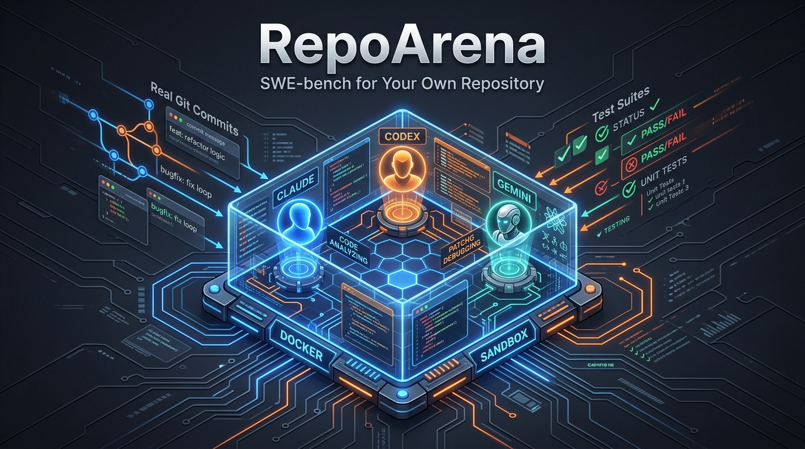
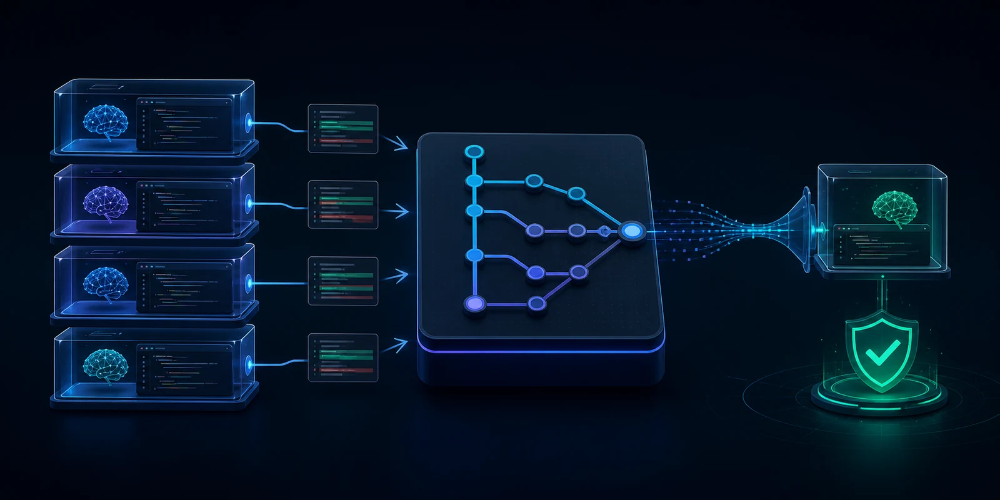

<div align="center">



# ⚔️ RepoArena (Türkçe)

### Kendi Özel Kod Deponuz İçin SWE-bench: AI Kodlama Ajanlarını Gerçek Proje Geçmişinizde Karşılaştırın

[](https://github.com/tugrakaymakcioglu/RepoArena/actions/workflows/ci.yml)
[](https://www.python.org/)
[](LICENSE)
[](#neden-repoarena)
[](#nas%C4%B1l-%C3%A7al%C4%B1%C5%9F%C4%B1r)
[](#varsay%C4%B1lan-gizlilik)

[English README](README.md) &nbsp;·&nbsp; [Kurulum](#kurulum) &nbsp;·&nbsp; [Nasıl Çalışır](#nas%C4%B1l-%C3%A7al%C4%B1%C5%9F%C4%B1r) &nbsp;·&nbsp; [Desteklenen Ajanlar](#desteklenen-ajanlar) &nbsp;·&nbsp; [Gizlilik](#varsay%C4%B1lan-gizlilik)

<br>

**Yapay zeka kodlama ajanlarını (Claude Code, Codex, Gemini CLI, OpenRouter) genel bir veri seti yerine doğrudan KENDİ projenizin geçmişindeki gerçek issue, PR ve testlerle Docker içinde adilce yarıştırın.**

</div>

<br>



Genel kodlama testleri (standart SWE-bench), bir ajanın genel halka açık görevlerde ne kadar iyi olduğunu söyler. Ancak ekibiniz için önemli olan soru şudur:

> **Hangi yapay zeka kodlama ajanı BİZİM projemizde ve mimarimizde en iyi sonucu veriyor?**

RepoArena, kod tabanınızın geçmişindeki commit'leri alır, insan çözümünü gizleyerek ajanlara aynı temiz problemi verir ve üretilen patch'leri izole Docker ortamında test eder.

---

## ⚖️ Neden RepoArena?

| Standart Genel Kriterler (SWE-bench vb.) | ⚔️ **RepoArena** |
| :--- | :--- |
| Halka açık genel görevleri ölçer | **Kendi reponuzun gerçek geçmişini ve domain kurallarını ölçer** |
| Genel dil ve framework dağılımlarını kullanır | **Sizin stack'inizi, kütüphanelerinizi ve test yapınızı korur** |
| Çözümler LLM'lerin eğitim verisine sızmış olabilir | **Çözümü gizlenmiş tek-commit'lik sentetik repolar üretir** |
| Genel bir global sıralama verir | **Projenize özel, tekrar üretilebilir net bir ajan kıyaslaması verir** |

---

## 🚀 Kurulum

```bash
git clone https://github.com/tugrakaymakcioglu/RepoArena.git
cd RepoArena

# uv ile (Önerilen)
uv tool install .

# veya pipx ile
pipx install .
```

### Docker İmajlarını Derleyin
```bash
# Windows PowerShell
powershell -ExecutionPolicy Bypass -File .\scripts\build-images.ps1

# Linux / macOS
sh ./scripts/build-images.sh
```

---

## ⚡ Hızlı Başlangıç

```bash
cd /path/to/your-project

repoarena init
repoarena doctor
repoarena discover
repoarena benchmark --agent codex
repoarena benchmark --agent claude
repoarena benchmark --agent gemini
repoarena benchmark --agent openrouter
repoarena report
```

---

## 🔒 Varsayılan Gizlilik

> **Kod tabanınız ve kıyaslama sonuçlarınız tamamen sizin makinenizde kalır.**

RepoArena hiçbir telemetri, analitik, harici bulut veritabanı veya gizli API ağ geçidi içermez. Tüm doğrulama çevrimdışı (offline) Docker konteynerlerinde yapılır.

---

## 📄 Lisans

Apache-2.0 Lisansı. Detaylar için [LICENSE](LICENSE) dosyasına bakınız.
